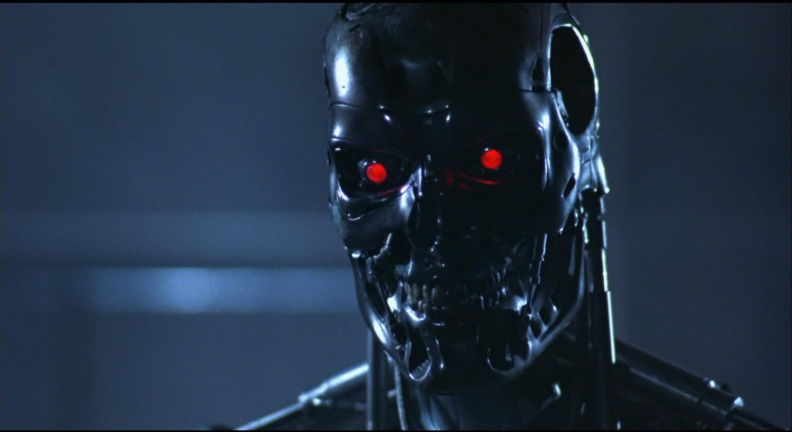
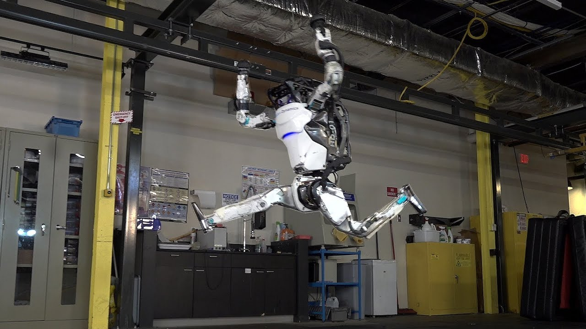
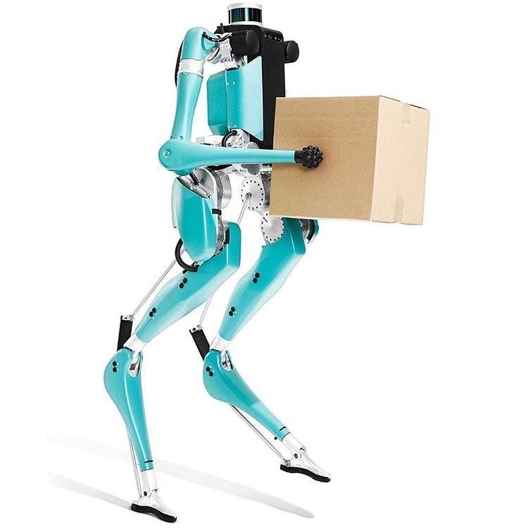
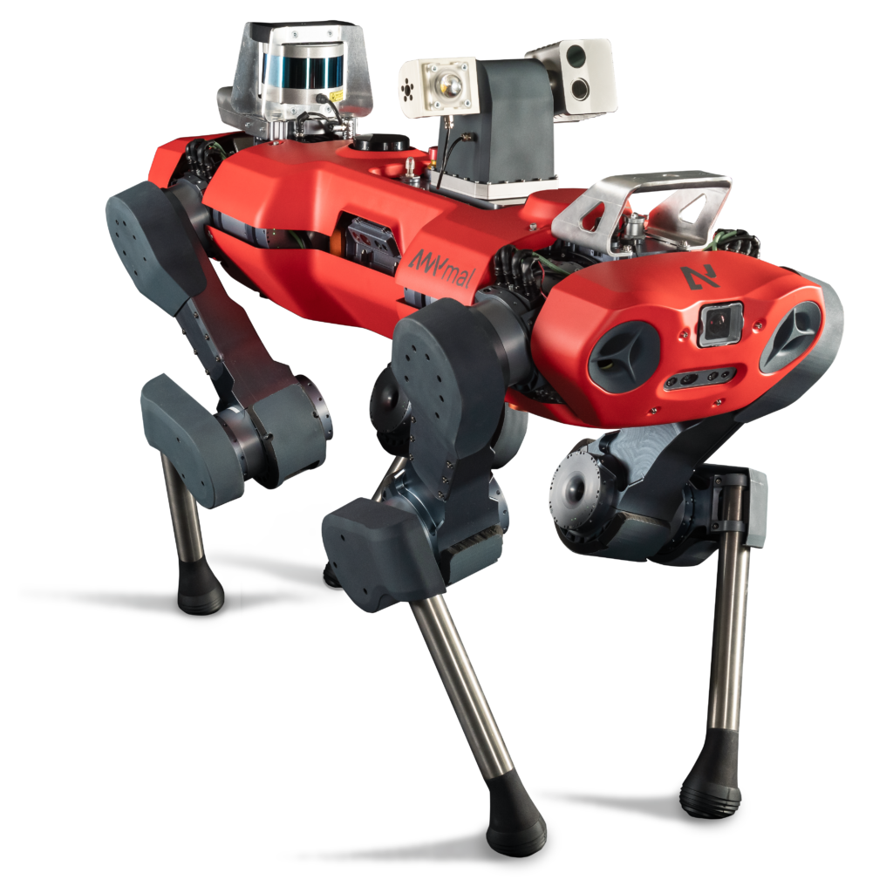
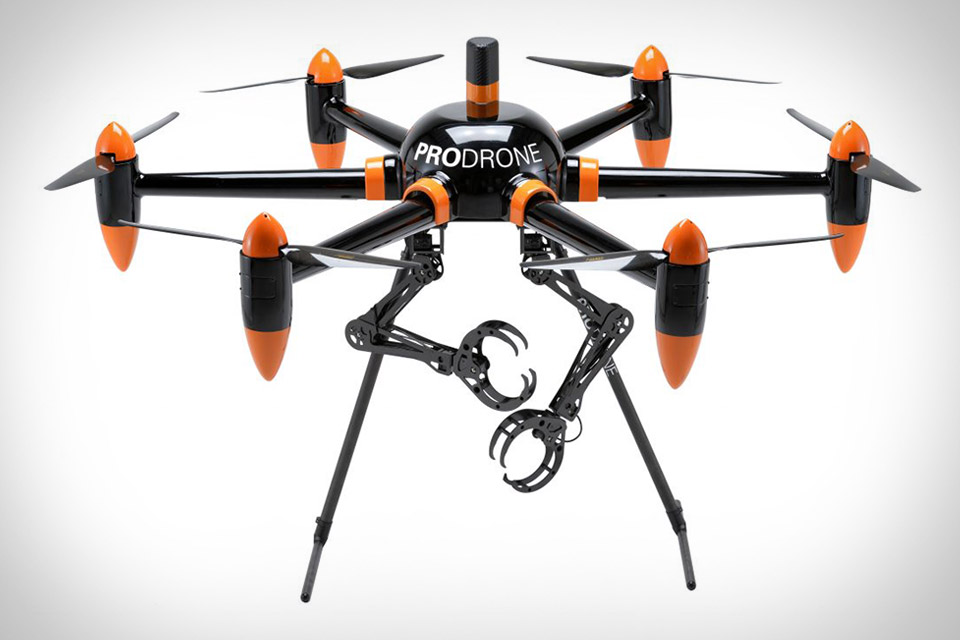

# Syllabus

## Syllabus {.smaller}

-   **Lecture:** Tue & Thur 2:00pm - 3:15pm, FPAT 253.

-   **Office Hours:** TBD

-   **Text:** Notes +*Modern Robotics*+ *Robot Modeling and Control*

-   **Workload:** 2.5 hours of lecture, 8 hours of reading notes,
    papers, and writing simulation code per week.

-   **Course announcements:** I use canvas to send information, but
    don't read inbox messages. Contacting me by email with **\[ME 676
    RMC\]:** or **\[AER 676 RMC\]:** makes it easy for me to track and
    respond to your emails.

-   **Course website:** All course material will be available on the
    website, which will be updated as the course proceeds.

## Syllabus {.smaller}
-   **Academic Integrity**

-   **Accommodations due to disability**

-   **Attendance Policy**

-   **Classroom Conduct**

-   **Excused Absences & Verification of Absences**

-   **Exams:** None.

-   **Homework:** Intermittent assignments, must adhere to rules in syllabus

-   **Grading:** See Syllabus. Subject to change.
 
## Course Overview

::: {.callout-tip}
## Learning Goal 

For you to be able to read and assimilate both recent
papers and early foundational papers on robotics. Furthermore, develop
programming skills that enable you to implement and try (possibly new)
methods in simulation.

:::

## Course Overview {.smaller}

Learning Goals:

1.  Understand coordinates and robot configurations.

2.  Understand how to transform the robot configuration into task
    coordinates and *vice versa*, along with the challenges in these
    processes.

3.  Learn approaches to planning motions in both task coordinates and
    robot configurations.

4.  Learn approaches to achieving planned motions using feedback
    control.

5.  Understand the challenges of state estimation.

6.  Learn optimization-based approaches to planning and control.

7.  Understand contact modeling and control challenges.

8.  Simulate robotic systems and test control algorithms.

## Course Overview  {.smaller}

Approaches for achieving goals:

-   Lecture/Discussion on

    1.  Coordinates

    2.  Dynamical Systems: single and articulated rigid bodies

    3.  Planning Trajectories

    4.  Sensing and State Estimation

    5.  Feedback Control

-   Research article discussions

-   Practice through assignments (code and question) and **Course Project**

## Expectations{.smaller}

-   You are reviewing notes and slides.

-   Comfort with mathematics:

    -   Abstract definitions.

    -   Imagining concrete examples to which they apply.

    -   Applying definitions to complete derivations and proofs.

-   Comfort with code:

    -   How to use documentation describing installation and use of
        packages.

    -   Awareness of the need to test code frequently
        tests will need testing.

-   Study groups. Don't go this one alone.

## About Me

-   Grew up in India (early childhood in England)

-   Undergraduate degree in Mech. Engg. in India

-   Masters in Mech. Engg focusing on Mechatronics

-   Ph.D in Electrical Engg. from UT Dallas: Legged Robots -> Graph Theory + Multi-robot coordination + Quadrotors

-   PostDoc at UT Austin: Stability Analysis of Classifier-in-the-Loop Systems

::: {.callout-tip icon="false" .fragment fragment-index=0}
## Research 
**Goal:** Get mechanical robots to control themselves.
:::

## About You 

On an index card / sheet of paper, write down:

1.  Name

2.  First robot you were aware of and/or Favorite robot

3.  Motivation for taking this course

4.  Concerns about the course

5.  Topics you wish were on the syllabus

6.  Topics you have already studied

7.  Learning/teaching styles that you feel work well for you

 
# Motivation 

## Motivation 

{width="80%"}

## Motivation 



## Motivation 

::: {.centered-content}
{width="50%"}
:::

## Motivation



## Motivation

::: {.centered-content-flex} 



:::
::: {.centered-content-flex} 



:::
<!-- {height="20%"} -->
<!-- {height="20%"} -->

<!-- {height="20%"} -->
<!-- {height="20%"} -->

## Exercise

Sketch a diagram describing your guess for the underlying system architecture that achieves these kinds of behaviors

## What's Left? 

- Touch feedback
- Human-Robot Interaction 
- Safety
- Reliability
- Energetic Efficiency

Previous: Will the prototype work? 

Now: Will this be a viable commercial product?

# My Research

## 

## Goal 

**Goal:** Get mechanical robots to control themselves.

**Day-to-day:**

- Theory from dynamics and control systems, 
- Algorithm development: optimization   
- Simulations/experiments

## Navigation using Deep Learning

::: {.centered-content}
{width="75%"}
:::

## End-to-end Neural Net Control

::: {.centered-content}

:::

## Navigation using Machine Learning

::: {.centered-content}

:::

+ Simple linear controller $< 1$ MB size 
	+ Based on the Support Vector Machine

+ Guaranteed to navigate hallway without crashing

## Results

<video width="32%"  controls autoplay="on" loop onloadstart="this.playbackRate = 2.0;">
  <source src="https://poonawalalab.github.io/ccs-seminar-slides/assets/IMG_0943.MOV" type="video/mp4">
</video>

<video width="32%"  controls autoplay="on" loop onloadstart="this.playbackRate = 2.0;">
  <source src="https://poonawalalab.github.io/ccs-seminar-slides/assets/robot_short_camnavonly.mov" type="video/mp4">
</video>

<video width="32%" controls autoplay="on" loop onloadstart="this.playbackRate = 2.0;">
  <source src="https://poonawalalab.github.io/ccs-seminar-slides/assets/robot_short_lidar.mov" type="video/mp4">
</video>

[^1]: 2x playback

## Guaranteed Collision Avoidance

::: {.centered-content}

:::

## Mapping 

::: {.centered-content}

:::

Uses Pose-Graph-based SLAM, A$^*$, and pure pursuit algorithm to get to a location. 

## Distance-based Navigation

::: {.centered-content}

:::

## Object-aware Navigation

::: {style=position:absolute;left:0px;top:100px;width:50%}
{width="50%"}
{width="50%"}
:::

::: {style=position:absolute;left:0px;bottom:100px;width:45%;font-size:5;}
Replace $1/r(\phi)$ with measure of object presence at $\phi$
:::

::: {.centered-content}
{width="40%"}
:::

::: {.fragment fragment-index=1 style=position:absolute;right:-100px;top:150px;width:45%;}
{width="60%"}

"Find [bus]{style=color:blue} below [tree]{style=color:green}. Approach and help [people]{style=color:red} getting on." 

:::

## Yolov9 Segmentation Model

::: {.centered-content}
![[Source: https://img.freepik.com/premium-vector/vector-realistic-washing-machine-white-3d-mockup_208581-782.jpg?semt=ais_hybrid]{style=font-size:10px}](https://poonawalalab.github.io/ccs-seminar-slides/assets/187674113-2074d658-f2fb-42d1-ac15-9c4a695e64d7.png){height="150px"}
:::

<video width="320" height="240" controls autoplay="on" loop onloadstart="this.playbackRate = 0.1;">
  <source src="https://poonawalalab.github.io/ccs-seminar-slides/assets/0b.mov" type="video/mp4">
</video>

<video width="320" height="240" controls autoplay="on" loop onloadstart="this.playbackRate = 0.1;">
  <source src="https://poonawalalab.github.io/ccs-seminar-slides/assets/1.mov" type="video/mp4">
</video>

<video width="320" height="240" controls autoplay="on" loop onloadstart="this.playbackRate = 0.1;">
  <source src="https://poonawalalab.github.io/ccs-seminar-slides/assets/2.mov" type="video/mp4">
</video>

::: aside 
Implementation by Karthika Hariprasad, Paul Dunbar High School
:::

## Contact-Rich Manipulation

::: {.centered-content}
{width="100%"}
:::

## Contact-Rich Manipulation

:::: {.columns}

::: {.column width="49%"}

<video width="100%"  controls autoplay="on" loop onloadstart="this.playbackRate = 2.0;">
  <source src="assets/videos/expert_short.mp4" type="video/mp4"/>
</video>

Guided Policy Search

:::

::: {.column width="49%"}

<video width="100%"  controls autoplay="on" loop onloadstart="this.playbackRate = 2.0;">
  <source src="assets/videos/no_expert_step.mp4" type="video/mp4"/>
</video>

No guidance

:::

::::

## Contact-Rich Manipulation

<video width="64%"  controls autoplay="on" loop onloadstart="this.playbackRate = 2.0;">
  <source src="assets/videos/EAGER_result_Jan26_clip.mp4" type="video/mp4">
</video>

## DL for Smart Sensors and Data

{height=300px}
{height=300px}
{height=300px}

{height=300px}
{height=300px}

## Tracking Robot Arms

::: {.centered-content}
{width="70%"}
:::

::: {style=position:absolute;top:50px;right:0px}
 </img>
:::

::: {style=position:absolute;top:300px;left:0px}
 </img>
:::

::: {style=position:absolute;bottom:50px;right:0px}
 </img>
:::

## DREAM Model 
::: {.centered-content}
![[https://sim2realai.github.io/assets/img/2020-06-29/Lee_etal_2020_dream_panda_reaching_frame.png]{style=font-size:15px}](https://sim2realai.github.io/assets/img/2020-06-29/Lee_etal_2020_dream_panda_reaching_frame.png)
:::

## DREAM Model

::: {.centered-content}

:::

+ 80 - 200 MB model depending on the backbone (VGG-X vs ResNet-X)

## DREAM On Jetson Nanos 

::: {.centered-content}
{width="30%"}
{width="30%"}
{width="30%"}
:::

::: aside 
Implementation by Varun Hariprasad
:::

